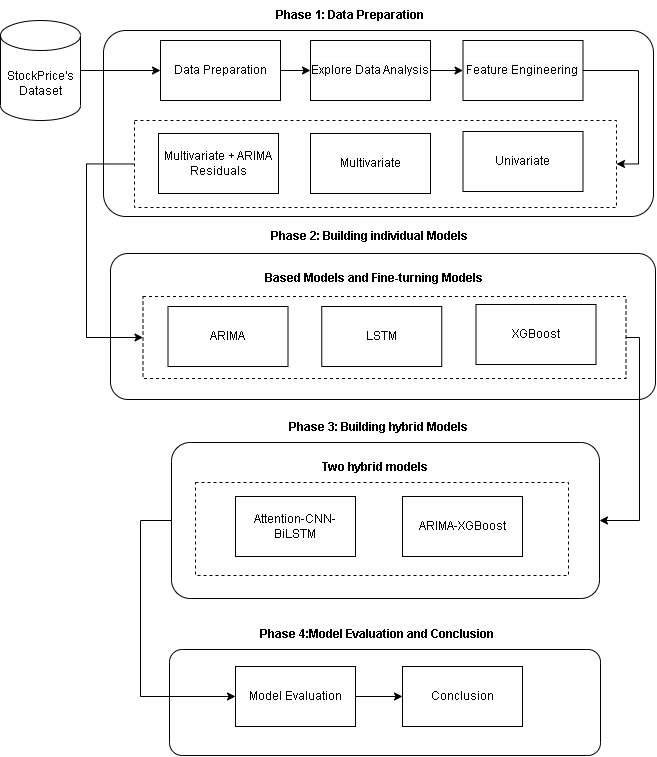

# In this project, we reuse and adapt relevant functions from related research to our specific research context 
Original source is available at https://github.com/zshicode/attention-clx-stock-prediction
## Background
The stock market is characterized by volatile prices and rapid market changes, necessitating
the development of accurate stock price prediction models to assist investors. Traditional
models like ARIMA have limitations in capturing the nonlinear nature of stock price time
series and require certain assumptions to be satisfied. Advanced models such as XGBoost and LSTM exhibit strong nonlinear generalization capabilities.  Our project discovers the hybrid model performance in real-world stock price forecasting scenarios.
## Objective
Our objective is to validate the effectiveness of individual models and hybrid models on Vietnamese stock price datasets. To accomplish this, we conduct a comprehensive analysis using the VGI Stock Price
Dataset, comprising features such as date, close, open, high, low, nmVolume, and residuals
obtained from the ARIMA model. Leveraging this dataset, we design a series of
experiments to evaluate the performance of various models, including ARIMA,
XGBoost, and the hybrid model. Through comparison and analysis of the results, we aim
to identify the most effective approach for our work.
## Framework

The proposed framework for hybrid model for stock price prediction
## Results
The research project accomplished the development and evaluation of diverse models for
stock price forecasting, encompassing both individual models and hybrid models. These
models were rigorously assessed using key evaluation metrics such as MAE, RMSE, R2
Score, and MAPE. Notably, the hybrid models, with a specific focus on the ARIMAXGBoost model, exhibited enhanced forecasting accuracy when compared to traditional approaches. This outcome highlights the potential effectiveness of integrating various
techniques and models to improve the precision of stock price prediction.
## Citation
```
@article{shi2022attclx,
    author={Zhuangwei Shi and Yang Hu and Guangliang Mo and Jian Wu},
    title={Attention-based CNN-LSTM and XGBoost hybrid model for stock prediction},
    journal={arXiv preprint arXiv:2204.02623},
    year={2022},
}
```

## Requirements

The code has been tested running under Python 3.7.4, with the following packages and their dependencies installed:
```
numpy==1.16.5
sklearn==0.21.3
statsmodels==0.10.1
pandas==0.25.1
tensorflow==2.1.0
keras==2.3.1
xgboost==1.5.0
```

The stock data we used are organized in data folder
The models for stock prediction are contained in scr folder

## Usage

- Run 'ARIMA.ipynb' for ARIMA predictions, and obtaining residuals feature
- Run 'ARIMA-XGBoost.ipynb' for the hybrid ARIMA-XGBoost model.
- Run 'Att_CNN_LSTM.ipynb' for the hybrid Attention-based CNN-LSTM.

