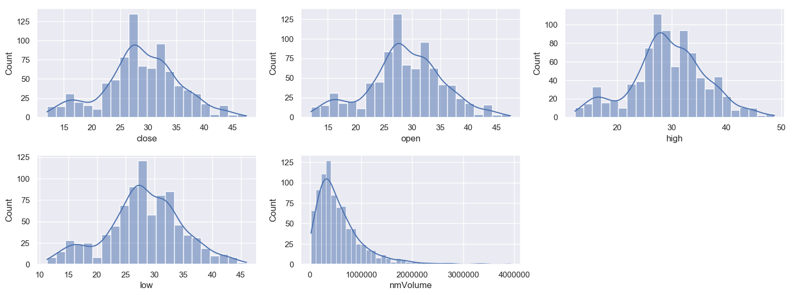
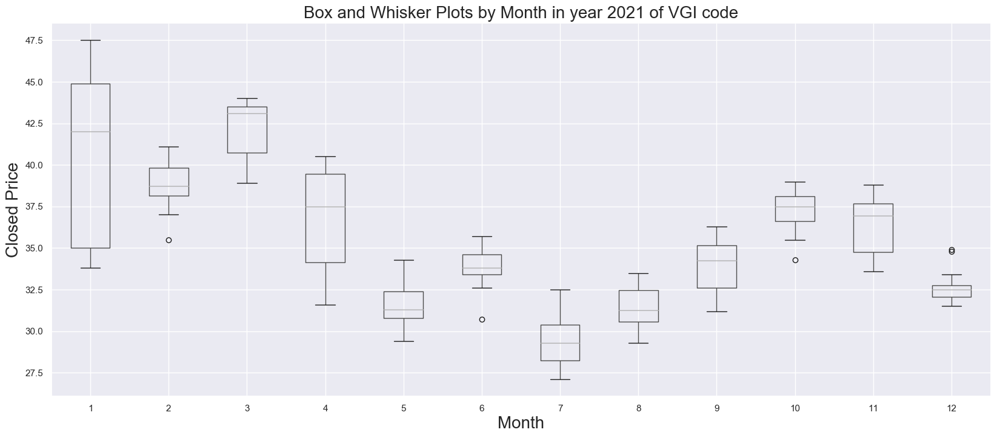
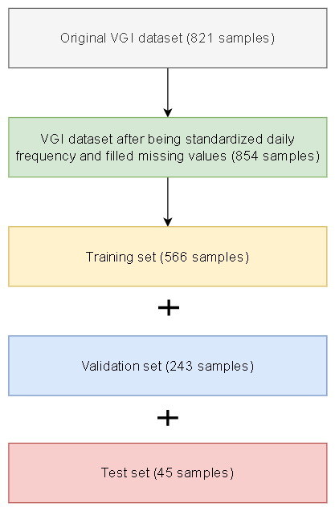
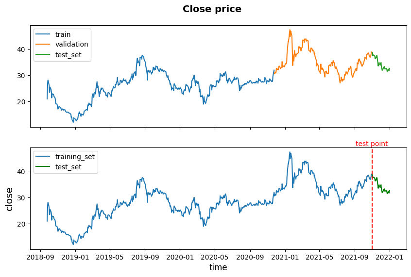
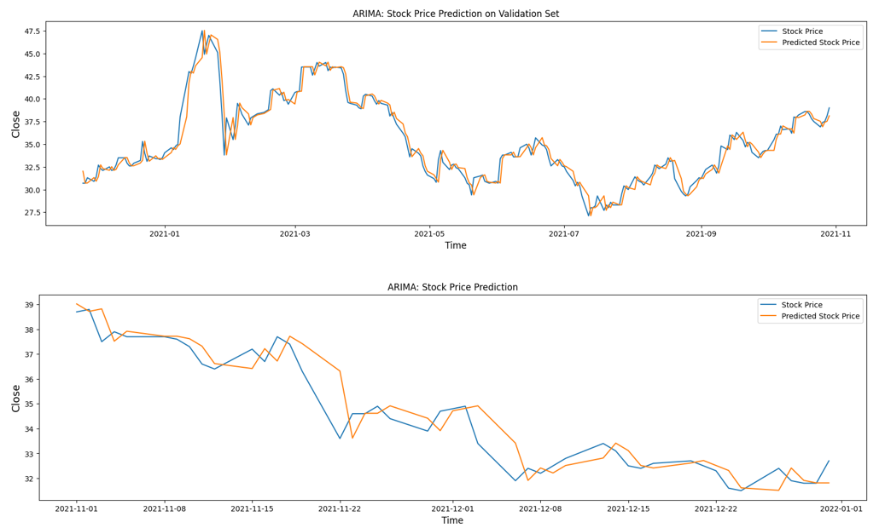
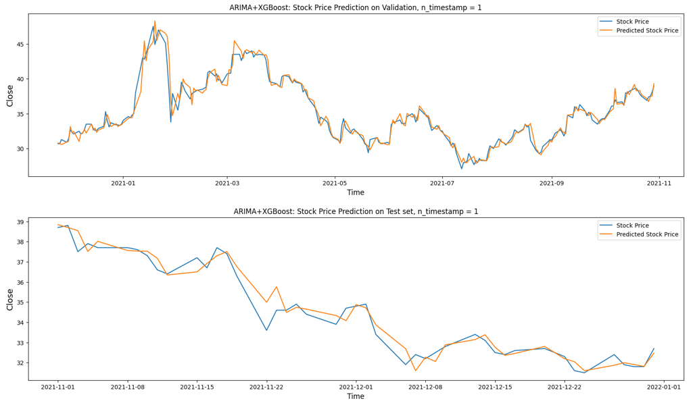
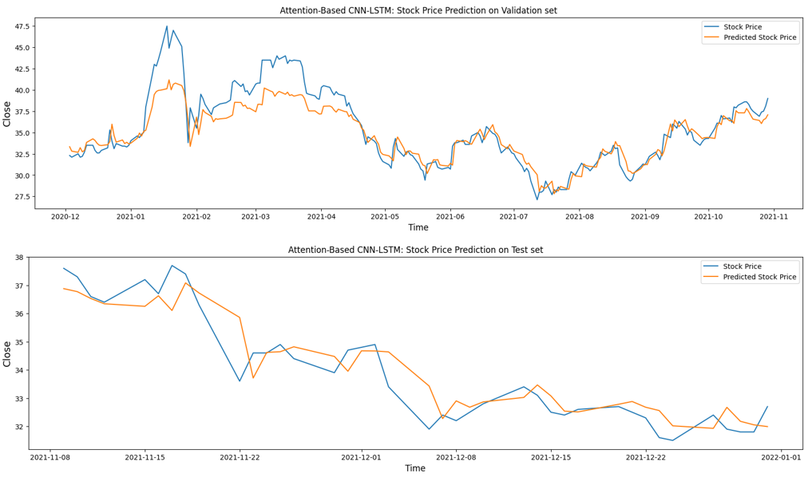

## Histplot data after converting time series to specified frequency and fill nan values.

```diff
- text in red
<p><span style="color: red;">**Table. Statistic Description**</span></p>

| Feature   | count |   mean  |   std   |  min  |  25%   |  50%   |  75%   |  max   |
|-----------|-------|---------|---------|-------|--------|--------|--------|--------|
| close     |  854  | 28.78   | 6.7141  |  12   | 25.2   | 28.3   | 32.9   | 47.5   |
| open      |  854  | 28.765  | 6.7101  |  12   | 25.1   | 28.35  | 33     | 47.5   |
| high      |  854  | 29.378  | 6.8307  |  12.3 | 25.725 | 28.8   | 33.5   | 48.8   |
| low       |  854  | 28.138  | 6.5788  |  11.3 | 24.525 | 27.9   | 32.2   | 46     |
| nmVolume  |  854  | 575751  | 468566  | 19385 | 273130 | 446002 | 740738 | 3925002|
## Box and Whisker Plots by Month in year 2021 of VGI code

## Splitting Time Series Data for training and testing process

Table. Splitting Time Series Data 
| Set            | Start Date | End Date   |
|----------------|------------|------------|
| Training Set   | 2018-09-25 | 2020-11-24 |
| Validation Set | 2020-11-25 | 2021-10-29 |
| Test Set       | 2021-11-01 | 2021-12-31 |

## Experimental Results
### Evaluation and Results of ARIMA
#### Feature: Closing price

Table. ARIMA performance
| Set            |   MAE   |   RMSE   | R2 Score |  MAPE  |
|----------------|---------|----------|----------|--------|
| Validation Set | 0.70380 | 1.02561  | 0.94587  | 1.988  |
| Test Set       | 0.51793 | 0.72907  | 0.89888  | 1.510  |
### The experiment result on hybrid ARIMA and XGBoost with the parameter  n_timestamp = 1
#### Feature: Close, Open, High, Low, nmVolume, ARIMA Residuals

Table. Hybrid ARIMA and XGBoost performance
| Set            |   MAE   |   RMSE   | R2 Score |  MAPE  |
|----------------|---------|----------|----------|--------|
| Validation Set | 0.57544 | 0.91457  | 0.95696  |  1.59  |
| Test Set       | 0.32653 | 0.45233  | 0.96108  |  0.95  |
### Evaluation and Results of hybrid Attention-Based CNN-LSTM 
#### Feature: Close, Open, High, Low, nmVolume, ARIMA Residuals

Table. Hybrid Attention-Based CNN-LSTM performance
| Set            |   MAE   |   RMSE   | R2 Score |  MAPE  |
|----------------|---------|----------|----------|--------|
| Training Set   | 0.84189 | 1.24881  | 0.96578  |  2.9   |
| Validation Set | 1.32415 | 1.86174  | 0.82230  |  3.49  |
| Test Set       | 0.52647 | 0.71036  | 0.86659  |  1.56  |
